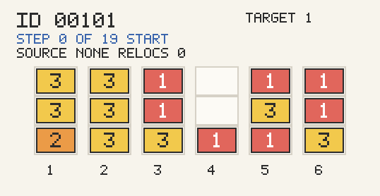

# RBRP-dup Q-Learning PoC



Example solve animation for `data/dup_dataset/alpha=0.2/3-6-16/00101.txt`, generated with `200` training episodes.

This repository contains a proof-of-concept implementation of a Q-learning-based solver for the restricted block relocation problem with duplicate priorities (RBRP-dup).

- It models the problem as a tabular Q-learning task.
- It trains per instance, not across a whole dataset.
- It uses a heuristic both to initialize Q-values and to fall back when the Q-table is incomplete.
- It is optimized for clarity and correctness over large-scale benchmark throughput.

## Problem Model

The repository solves the restricted BRP with duplicate priorities.

- Each bay is a set of stacks with a fixed maximum height.
- Lower priority values are retrieved first.
- Multiple containers may share the same priority.
- A retrieval action removes a top container whose priority belongs to the current target group.
- A relocation action moves a blocking top container from one stack to another.
- Because this is the restricted variant, relocation is only allowed from stacks that currently block at least one target-priority container.

The reward model matches the paper at a high level:

- Retrieval reward: `0`
- Relocation reward: `-1`

Minimizing relocations is therefore equivalent to maximizing total reward.

## What Is Implemented

The implemented pipeline has two phases.

### 1. Learning phase

For a single instance:

- Represent the bay as a fixed-capacity matrix-like state.
- Flatten that state into a tuple to use as a Q-table key.
- Enumerate legal actions.
- Initialize unseen state-action pairs with a heuristic estimate.
- Run tabular Q-learning with epsilon-greedy action selection.

The learning parameters are configurable. Current defaults are:

- `alpha = 0.75`
- `gamma = 1.0`
- `epsilon = 0.1`
- `max_episodes = 250`

### 2. Optimization / solve phase

After training:

- Start again from the initial bay state.
- If the Q-table contains values for legal actions in the current state, choose the best-valued action.
- If the Q-table does not contain any legal action for the state, fall back to the heuristic.

This makes the solver robust even when training has not visited every reachable state.

## State and Action Representation

### State

The state is represented by [BayState](src/rbrp_dup/models.py).

- Each stack is stored bottom-to-top as a tuple of priorities.
- The full state is a tuple of stacks.
- `max_height` is stored alongside the stacks.
- `flatten()` converts the state into a zero-padded tuple suitable for Q-table keys.

Example:

- Stack `1` with priorities `(3, 4, 2)` means `3` is at the bottom and `2` is on top.
- Empty cells are represented only in the flattened key, not inside the stack tuples.

### Action

Actions follow the paper’s two-integer encoding:

- `(from_stack, 0)` means retrieval
- `(from_stack, to_stack)` with `to_stack > 0` means relocation

Stack indices are 1-based in the public API and CLI output.

## Legal Action Rules

The core BRP transition logic is implemented in [bay.py](src/rbrp_dup/bay.py).

### Target group

The current target group is the minimum priority still present in the bay.

### Retrieval filtering

If any target-priority container is already on top of its stack, the legal action set is restricted to retrieval actions only.

This is the “optimal rule” pruning used in the PoC: once an immediate retrieval exists, relocation is not considered for that state.

### Restricted relocations

If no retrieval is available:

- Find all stacks that contain a target-priority container below their top.
- Only the top container of those stacks can be relocated.
- The destination can be any other non-full stack.

## Heuristic Policy

The heuristic is implemented in [heuristic.py](src/rbrp_dup/heuristic.py).

It is used in two places:

- Dynamic initialization of unseen Q-values
- Fallback decisions during the solve phase

### Rule 1: choose the target container

Among all containers in the current target-priority group, the heuristic selects the one with the fewest blockers above it.

Current deterministic tie-break:

- fewer blockers
- smaller stack index
- container closer to the top within that stack

### Rule 2: choose the destination stack

For the blocking top container that must be moved:

- A destination is considered safe if placing the container there does not immediately create a new blocking with respect to the current priority ordering.
- In code, that means the moved priority is less than or equal to the minimum priority already present in the destination stack.

Destination selection is then:

- If safe destinations exist: choose the one with the highest maximum priority.
- Otherwise: choose the one with the lowest maximum priority.

Current deterministic tie-break:

- prefer shorter stacks
- then smaller stack index

This is the Min-Max-style rule used by the PoC.

### Heuristic rollout

The helper `rollout_heuristic(state)` repeatedly applies the heuristic until the bay is empty and returns:

- the number of relocations
- the action sequence

That relocation count is used as an optimistic initialization signal for unseen Q-table entries.

## Q-Learning Details

The learning logic is in [qlearning.py](src/rbrp_dup/qlearning.py).

### Q-table shape

The Q-table is:

```python
dict[StateKey, dict[Action, float]]
```

Where:

- `StateKey` is the flattened zero-padded bay
- each state maps to action-value estimates

### Initialization of unseen actions

When the trainer sees a legal action for a state that is not yet in the Q-table:

1. Simulate the action once.
2. If the resulting state is terminal, initialize the value with the immediate reward.
3. Otherwise, run the heuristic from the next state.
4. Initialize `Q(s, a)` with:

```text
reward - heuristic_remaining_relocations
```

This matches the paper’s idea of heuristic-based dynamic initialization.

### Action selection during training

Training uses epsilon-greedy behavior:

- with probability `epsilon`, choose a random legal action
- otherwise, choose one of the best-valued legal actions

Ties are broken randomly during training, using the configured seed.

### Update rule

The implementation uses standard one-step Q-learning:

```text
Q(s, a) <- Q(s, a) + alpha * (reward + gamma * max_a' Q(s', a') - Q(s, a))
```

If the next state is terminal, the bootstrapped future term is `0`.

## Dataset Format

The real dataset is stored under [data/dup_dataset](data/dup_dataset).

Example path:

```text
data/dup_dataset/alpha=0.2/3-10-27/10001.txt
```

The directory `3-10-27` encodes:

- max height `3`
- number of stacks `10`
- number of blocks `27`

Each file has the format:

```text
W N
c1 p11 p12 ... 
c2 p21 p22 ...
...
```

Where:

- `W` is the number of stacks
- `N` is the total number of blocks
- each following line describes one non-empty stack
- the first integer is the number of blocks in the stack
- the remaining integers are priorities from bottom to top

Example:

```text
10 27
3 3 4 2
2 2 5
...
```

The loader pads missing stacks with empty stacks until it reaches `W`.

Small handcrafted test fixtures are stored in [data/fixtures](data/fixtures).

## Project Structure

```text
.
├── main.py
├── spec.md
├── data/
│   ├── dup_dataset/
│   └── fixtures/
├── src/rbrp_dup/
│   ├── __init__.py
│   ├── __main__.py
│   ├── bay.py
│   ├── cli.py
│   ├── dataset.py
│   ├── heuristic.py
│   ├── models.py
│   ├── qlearning.py
│   ├── render.py
│   └── solver.py
└── tests/
    ├── test_bay.py
    ├── test_dataset.py
    ├── test_render.py
    └── test_solver.py
```

### File responsibilities

- [main.py](main.py): thin entrypoint that adds `src/` to `sys.path` and launches the CLI.
- [src/rbrp_dup/models.py](src/rbrp_dup/models.py): dataclasses for states, instances, configs, training artifacts, solutions, and reports.
- [src/rbrp_dup/dataset.py](src/rbrp_dup/dataset.py): recursive dataset discovery and TT-format parsing.
- [src/rbrp_dup/bay.py](src/rbrp_dup/bay.py): legal action generation, target group detection, and state transitions.
- [src/rbrp_dup/heuristic.py](src/rbrp_dup/heuristic.py): heuristic target selection, Min-Max-style destination choice, and heuristic rollout.
- [src/rbrp_dup/qlearning.py](src/rbrp_dup/qlearning.py): Q-table training loop and heuristic-based initialization.
- [src/rbrp_dup/render.py](src/rbrp_dup/render.py): frame rendering and `ffmpeg`-based GIF assembly.
- [src/rbrp_dup/solver.py](src/rbrp_dup/solver.py): solve-time policy, heuristic fallback, and batch runner.
- [src/rbrp_dup/cli.py](src/rbrp_dup/cli.py): command-line interface.
- [tests](tests): coverage for parsing, legal actions, heuristic behavior, training, rendering, and batch execution.

## Running the Project

The code currently uses only the Python standard library.

### Single instance

```bash
python3 main.py solve data/fixtures/3-3-5/blocked.txt
```

Useful options:

- `--trace`: print the bay before and after every chosen action
- `--alpha`
- `--gamma`
- `--epsilon`
- `--max-episodes`
- `--time-limit-seconds`
- `--seed`

Example:

```bash
python3 main.py solve data/dup_dataset/alpha=0.2/3-10-27/10001.txt --max-episodes 50 --seed 1
```

### Batch mode

```bash
python3 main.py batch data/dup_dataset/alpha=0.2/3-10-27 --limit 10 --max-episodes 25
```

This prints:

- number of processed instances
- average relocations
- total runtime
- one line per instance with relocation count, action count, episodes, and how many decisions came from the Q-table vs heuristic fallback

### GIF generation

```bash
python3 main.py gif data/fixtures/3-3-5/blocked.txt --max-episodes 50 --seed 1 --output out/blocked.gif
```

This command:

- trains on the selected instance
- solves it with trace enabled
- renders one frame per state transition
- invokes `ffmpeg` to build a looping GIF

Useful option:

- `--fps`: controls animation speed

## Running Tests

```bash
PYTHONPATH=src python3 -m unittest discover -s tests -v
```

The test suite currently checks:

- dataset parsing
- fixture and real-instance loading
- target and action legality logic
- heuristic determinism on small cases
- end-to-end training and solve on small fixtures
- batch execution

## Current Behavior and Limitations

This repository is a working PoC, not a reproduction of the paper’s full experimental setup.

Important limitations:

- Training is per instance, not a generalized learned policy over many instances.
- The implementation uses a compact tabular Q-table and can grow quickly on larger instances.
- The solve phase may still rely heavily on heuristic fallback unless the episode budget is large enough.
- The optimization phase currently chooses among known best actions deterministically with `min(best_actions)`, rather than using a more elaborate tie-break.
- The implementation focuses on the main RBRP-dup mechanics and the learning-plus-heuristic structure, not on reproducing the entire benchmark protocol from the paper.

## References

1. Y. Jin and S. Tanaka, "A Q-Learning-based algorithm for the block relocation problem," *Journal of Heuristics*, vol. 31, article 14, 2025. DOI: https://doi.org/10.1007/s10732-024-09545-y
2. R. Jovanovic and S. Voß, "A chain heuristic for the blocks relocation problem," *Computers & Industrial Engineering*, vol. 75, pp. 79-93, 2014. DOI: https://doi.org/10.1016/j.cie.2014.06.010
3. Shunji Tanaka, "Block Relocation Problem" benchmark instances: https://sites.google.com/site/shunjitanaka/brp
